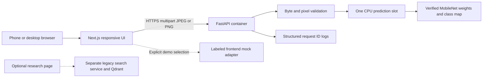
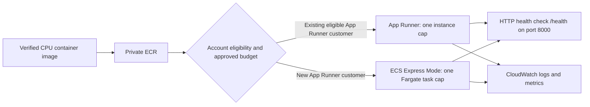

# Classification deployment architecture — issue #6

Prepared 2026-10-08; explanation integration added 2026-10-09. Local MVP: Next.js phone browser UI → FastAPI → one CPU model in one container. `/predict` and the optional `/explain` Grad-CAM++ action share the model and CPU slot. Qdrant, search encoders, S3, Cognito and DynamoDB remain optional follow-ups. Grad-CAM imports are lazy and are not required for classification startup; its dependency is included for the explanation endpoint.



Weights and class map are baked into the image so cold startup does not download them or depend on S3. The selected MobileNetV3 independent checkpoint is about 5.96 MiB and outperforms the available MobileNet KD checkpoint on the audited splits. Loading is strict and CPU-only; failure produces unhealthy readiness instead of serving random weights. One Uvicorn process loads one model and limits CPU work to one call. No image file is retained by application logic after prediction; framework multipart buffering can use temporary storage, and decoded images are closed after inference. No upload contents or filenames are logged.

## AWS choice depends on account eligibility

App Runner stopped accepting new customers on **2026-04-30**. Existing customers can continue using it; new-customer eligibility for the supplied Console name `stark1` is unknown. AWS recommends ECS Express Mode as an alternative. Therefore App Runner is a conditional option, not an assumed available service. [AWS availability notice](https://aws.amazon.com/apprunner/), [AWS migration guidance](https://docs.aws.amazon.com/apprunner/latest/dg/apprunner-availability-change.html)



For the App Runner option, configure HTTP `/health`; its default health protocol is TCP and would not verify a loaded model. Use a private ECR access role with the App Runner build trust principal; no instance role is required for this container's current runtime because it makes no AWS API calls. [Health checks](https://docs.aws.amazon.com/apprunner/latest/dg/manage-configure-healthcheck.html), [App Runner IAM roles](https://docs.aws.amazon.com/apprunner/latest/dg/security_iam_service-with-iam.html)

For ECS Express Mode, the execution role pulls the image and the infrastructure role provisions the service resources. Express Mode also creates underlying Fargate, load balancer, autoscaling and networking resources; their costs must be included in approval. Keep task count capped at one for the proposed demo and route health checks to `/health`. [ECS Express Mode overview](https://docs.aws.amazon.com/AmazonECS/latest/developerguide/express-service-overview.html)

The reviewed proposal is one vCPU and 2 GiB memory, `MODEL_THREADS=1`, one warm instance/task, no automatic image redeploy and explicit allowed frontend origins. Sizing is a starting proposal, not an AWS measurement or cost approval. Benchmark the built Linux image before adjusting it. Region, budget, cost owner and real IAM permissions remain unverified; see [aws-readiness.md](aws-readiness.md).

## Build and fallback

`Dockerfile` packages the real MobileNet checkpoint, verified class map, standalone backend and CPU-only dependencies; it uses a non-root user and one worker. `.dockerignore` excludes datasets, other checkpoints and local credentials. Review-only App Runner/ECS request templates are in `deploy/`; they contain placeholders and create no resources by themselves.

```powershell
docker build -t plant-disease-api:s01 .
docker run --rm -p 8000:8000 -e CORS_ORIGINS=http://localhost:3000 plant-disease-api:s01
```

Docker build/run was **not verified** on this workstation because the Docker daemon is unavailable. Native FastAPI, real CPU inference, generated OpenAPI and browser integration were verified. CPU dependency installation in Linux and container health must pass on a machine with Docker before publishing the image. Checkpoints must be supplied locally; the Docker build deliberately fails if the chosen artifact is absent.

If cloud permissions, service eligibility or approved funds are missing, run the same FastAPI application and Next.js UI locally/LAN for the OJT demo. Do not replace cloud deployment with unapproved EC2, ALB or other paid resources. When approved, a hosted frontend uses `NEXT_PUBLIC_API_URL` and explicit CORS; no AWS access key belongs in browser configuration. Authentication/rate limiting and a fresh dependency review are required before a public deployment, which was not performed in this task. Runtime advisories were addressed locally; remaining build/lint findings are recorded in [frontend-dependency-review.md](frontend-dependency-review.md).
